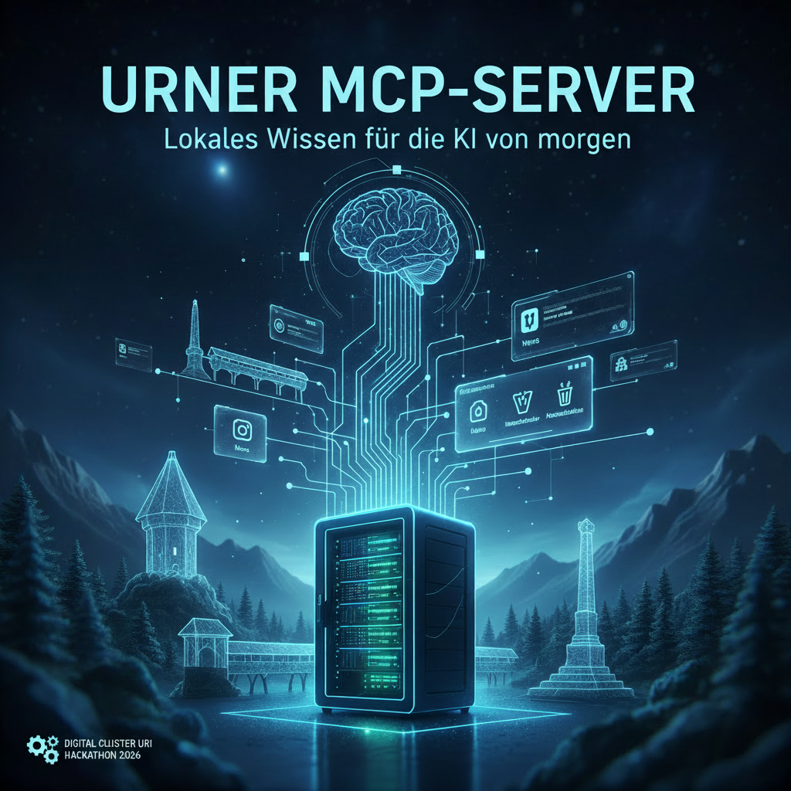

# Urner MCP Server

This is the repo for the challenge [Urner MCP Server](https://hack.digital-cluster-uri.ch/project/50) of the [Data Hackdays Uri 2026](https://erp.digital-cluster-uri.ch/hackdays-uri-2026).



## MCP Host

To start the MCP Host consisting of the Open Web UI, run the following command. It's available at [http://localhost:3000](http://localhost:3000).

```bash
cd mcphost
docker compose up -d
```
